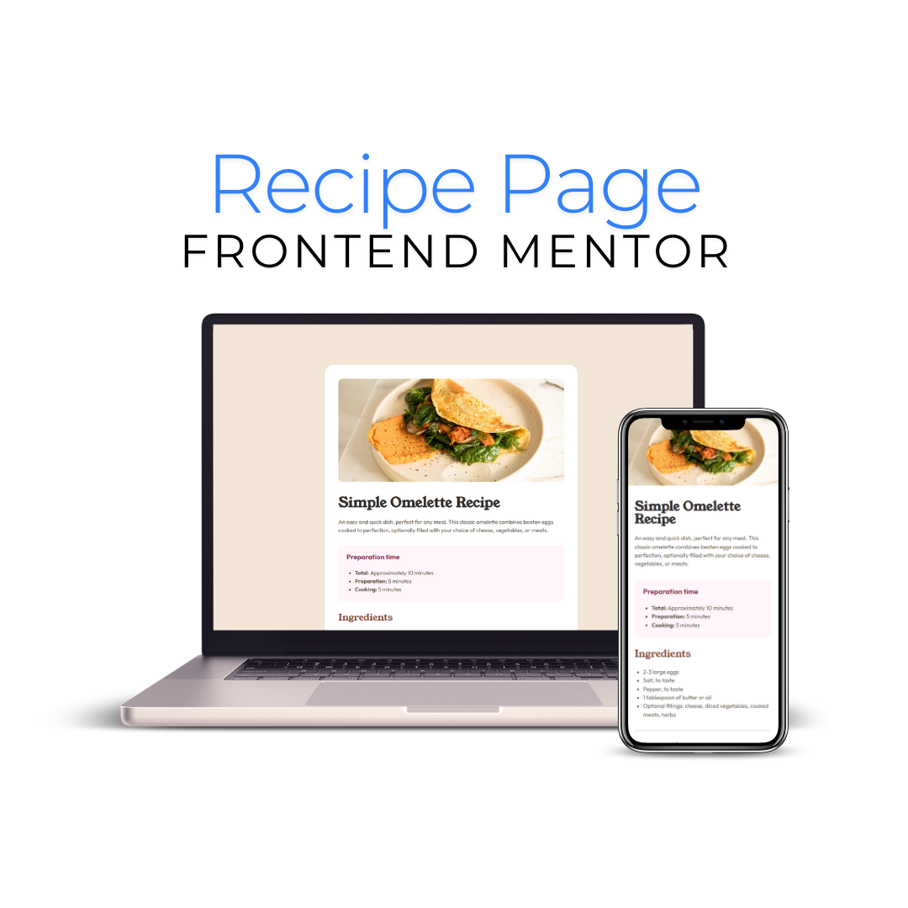

# Frontend Mentor - Recipe page solution

This is a solution to the [Recipe page challenge on Frontend Mentor](https://www.frontendmentor.io/challenges/recipe-page-KiTsR8QQKm). Frontend Mentor challenges help you improve your coding skills by building realistic projects. 

## Table of contents

- [Frontend Mentor - Recipe page solution](#frontend-mentor---recipe-page-solution)
  - [Table of contents](#table-of-contents)
  - [Overview](#overview)
    - [Screenshot](#screenshot)
    - [Links](#links)
  - [My Process](#my-process)
    - [Built with](#built-with)
    - [What I Learned](#what-i-learned)
    - [Continued Development](#continued-development)
    - [Author](#author)
  - [Acknowledgments](#acknowledgments)

## Overview

### Screenshot

### Links

- Solution URL: [Github](https://github.com/brunagoncalves/recipe-page)
- Live Site URL: [RecipePage](https://brunagoncalves.github.io/recipe-page/)

## My Process

### Built with

- Semantic HTML5 markup
- CSS custom properties
- Flexbox for layout
- Mobile-first workflow

### What I Learned

I focused on a mobile-first approach to ensure responsiveness.

### Continued Development

For future projects, I’d like to improve my skills with Flexbox and Grid, as well as focus more on creating reusable components. I also plan to experiment more with accessibility techniques.

### Author

- Frontend Mentor - [@brunagoncalves](https://www.frontendmentor.io/profile/brunagoncalves)
- Twitter - [@BruhnaGoncalves](https://www.twitter.com/BruhnaGoncalves)

## Acknowledgments

This is where you can give a hat tip to anyone who helped you out on this project. Perhaps you worked in a team or got some inspiration from someone else's solution. This is the perfect place to give them some credit.